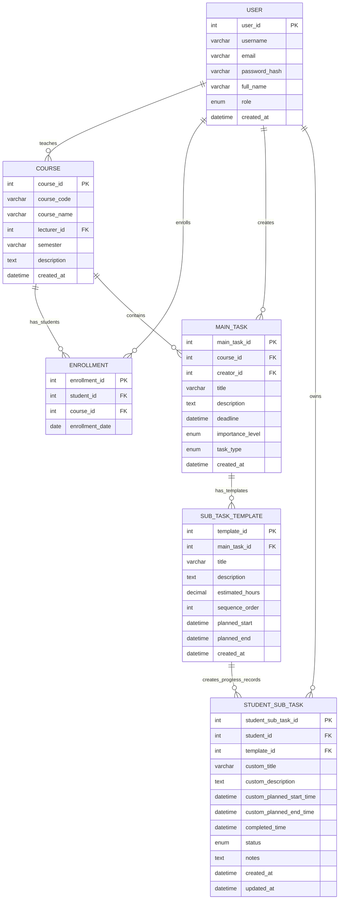

# StudyPal Database ER Diagram

更新时间：2026-05-26

下面是 StudyPal 数据库表之间的关系图。此版本去掉 `study_session`，并采用更规范的任务创建逻辑：

- `main_task.creator_id` 指向 `user.user_id`，表示具体是谁创建了任务。
- 教师/学生身份从 `user.role` 推出，不再在 `main_task` 中重复保存 `role`。
- `main_task.task_type` 表示任务性质，例如课程布置任务或学生个人任务。



核心业务链路：

```text
course -> main_task -> sub_task_template -> student_sub_task
```

任务创建链路：

```text
user -> main_task.creator_id
user.role = LECTURER 或 STUDENT
main_task.task_type = COURSE_ASSIGNED 或 PERSONAL
```

学生选课链路：

```text
user(role = STUDENT) -> enrollment -> course
```

教师授课链路：

```text
user(role = LECTURER) -> course.lecturer_id
```

设计提醒：

```text
main_task.creator_id 表达具体是哪位老师或学生创建了任务。
创建者身份通过 user.role 判断，避免在 main_task 中重复保存 role。
main_task.task_type 表达任务性质，例如课程布置任务或学生个人任务。
```
