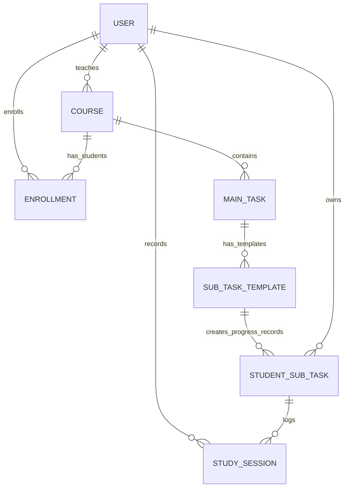

# StudyPal 项目参考文档

本文档合并自旧需求文档、数据库设计说明、ER 图、项目状态和开发任务清单。当前仓库已经清理为“前端 + 文档”状态，旧 Java/JDBC/Maven 后端和 SQL 脚本已经删除；后续后端应按这里的业务口径重新实现。

详细页面路由、Servlet 接口和 JSP 对接方式见 `frontend-backend-integration-guide.md`。

## 1. 产品定位

StudyPal 是一个面向大学课程学习支持场景的多角色系统，不是单人待办清单。

系统目标：

- 帮学生管理课程任务、子任务进度和学习记录。
- 帮教师发布课程级任务并查看学生完成情况。
- 帮管理员查看全局课程、用户、任务和学习状态。
- 让课程压力、任务进度和实际学习投入可视化。

## 2. 用户角色

| 角色 | 核心权限 |
| --- | --- |
| Student | 加入课程；查看已加入课程的任务；更新自己的子任务进度；记录自己的学习时间。 |
| Lecturer | 管理自己负责的课程；发布课程级 MainTask；查看自己课程内学生的完成进度。 |
| Admin | 查看全局用户、课程、任务、进度和学习统计；对任务和学生进度建议保持只读。 |

权限边界：

- 学生不能创建、编辑或删除课程级 MainTask。
- 学生只能修改自己的 StudentSubTask 和 StudySession。
- 教师只能管理自己课程下的 MainTask 和进度视图。
- Admin 可以看全局数据，但不应直接修改学生进度。

## 3. 核心概念

### Course

课程由一个 Lecturer 负责。学生可自助加入课程，当前设计不包含退课流程，也不需要教师审批。

### MainTask

MainTask 是教师发布的课程级任务，例如作业、项目、考试、阅读任务。它属于课程，不属于单个学生。

建议规则：MainTask 发布后不可编辑、不可删除。发布前应有确认弹窗提示“发布后不可修改”。

### SubTaskTemplate

SubTaskTemplate 是 MainTask 下的共享任务拆分模板。模板通常由 AI 生成，也可以在 AI 失败后使用默认模板生成。学生不直接修改共享模板。

默认 fallback 四步模板：

1. Understand requirements
2. Collect materials
3. Complete main work
4. Review and submit

### StudentSubTask

StudentSubTask 是学生个人进度记录，引用一个 SubTaskTemplate。它保存个人状态、完成时间、备注，以及可选的个人覆盖字段。

显示标题、描述和计划时间时应使用模板默认值与个人覆盖值合并：

```text
COALESCE(student_sub_task.custom_title, sub_task_template.title)
COALESCE(student_sub_task.custom_description, sub_task_template.description)
COALESCE(student_sub_task.custom_planned_start_time, sub_task_template.planned_start)
COALESCE(student_sub_task.custom_planned_end_time, sub_task_template.planned_end)
```

### StudySession

StudySession 记录学生实际学习投入，可关联到某个 StudentSubTask，也可以作为独立学习记录。

学习时长不建议作为基础字段保存，应由开始和结束时间动态计算：

```text
TIMESTAMPDIFF(MINUTE, start_time, end_time) / 60.0
```

## 4. 推荐数据模型

| 表 | 用途 | 关键字段 |
| --- | --- | --- |
| `user` | 统一用户账号 | `user_id`, `username`, `email`, `password_hash`, `full_name`, `role`, `created_at` |
| `course` | 课程 | `course_id`, `course_code`, `course_name`, `lecturer_id`, `semester`, `description`, `created_at` |
| `enrollment` | 学生选课关系 | `enrollment_id`, `student_id`, `course_id`, `enrollment_date` |
| `main_task` | 课程级主任务 | `main_task_id`, `course_id`, `title`, `description`, `deadline`, `importance_level`, `created_at` |
| `sub_task_template` | 共享子任务模板 | `template_id`, `main_task_id`, `title`, `description`, `estimated_hours`, `sequence_order`, `planned_start`, `planned_end` |
| `student_sub_task` | 学生个人进度 | `student_sub_task_id`, `student_id`, `template_id`, `custom_*`, `status`, `completed_time`, `notes` |
| `study_session` | 学习记录 | `study_session_id`, `student_id`, `student_sub_task_id`, `start_time`, `end_time`, `session_type`, `notes` |

设计规则：

- `main_task` 不保存 `student_id`。
- `course` 只保存 `lecturer_id`，不复制教师姓名或邮箱。
- `enrollment` 需要限制同一个学生不能重复加入同一门课程。
- `student_sub_task` 需要限制同一学生对同一模板只生成一条进度记录。
- 当前版本没有角色专属字段，因此 `user.role` 足够；如果后续增加学号、专业、教师办公室等字段，再拆 `student_profile` / `lecturer_profile`。

核心关系：



## 5. 核心业务流程

最重要的联调链路：

```text
用户登录或切换身份
-> 学生加入课程
-> 教师发布 MainTask
-> 系统生成 SubTaskTemplate
-> 系统为已选课学生生成 StudentSubTask
-> 学生更新子任务进度
-> 学生记录 StudySession
-> Dashboard 展示进度和学习统计
```

学生加入课程时：

1. 根据课程代码找到 Course。
2. 写入 Enrollment。
3. 为该课程已有 MainTask 下的所有 SubTaskTemplate 创建 StudentSubTask。
4. 拦截重复加入。

教师发布 MainTask 时：

1. 校验教师是否拥有该课程。
2. 创建 MainTask。
3. 调用 AI 生成 SubTaskTemplate。
4. AI 失败最多重试三次。
5. 仍失败则使用四步 fallback 模板。
6. 为课程内已选课学生批量创建 StudentSubTask。
7. 以上步骤建议放在同一事务里，避免半成品数据。

## 6. 页面与前端资产

当前可运行的静态前端在 `preview/`：

- `index.html`：入口页。
- `auth.html`：登录/注册入口。
- `student-home.html`, `student-courses.html`, `student-tasks.html`, `study-sessions.html`, `task-detail.html`：学生端页面。
- `lecturer-home.html`, `lecturer-courses.html`, `lecturer-tasks.html`, `lecturer-task-detail.html`：教师端页面。
- `admin-home.html`, `admin-users.html`, `admin-overview.html`, `admin-courses.html`：管理员端页面。
- `states.html`：空数据、无权限、错误、成功等状态页。

旧 JSP 前端模板保留在 `src/main/webapp/`，其中 `assets/css/workspace.css` 和 `assets/js/app.js` 仍被部分 `preview/` 页面复用。

运行静态预览：

```bash
python3 -m http.server 5173
```

打开：

```text
http://localhost:5173/preview/index.html
```

## 7. Dashboard 与统计建议

学生 Dashboard：

- 已加入课程数。
- 待完成任务数。
- 本周学习时长。
- 子任务完成率。
- 今日任务和最近 deadline。

教师 Dashboard：

- 负责课程数。
- 已发布任务数。
- 学生平均完成率。
- 风险学生数量，例如完成率低于 40%。
- 活跃 MainTask 列表。

Admin Dashboard：

- 总用户数和各角色人数。
- 课程总数。
- MainTask 总数。
- 近 30 天学习总时长。
- 全局任务完成率和课程负载。

## 8. 重做优先级

高优先级：

- 登录/当前用户机制与 Session。
- 角色权限校验。
- 学生加入课程。
- MainTask 发布事务。
- AI 生成 SubTaskTemplate、三次重试和 fallback。
- StudentSubTask 自动创建和学生进度更新。

中优先级：

- StudySession 完整 CRUD。
- Dashboard 统计。
- 表单校验、错误提示、空状态和无权限状态。
- 教师任务详情页的学生进度统计。

低优先级：

- Schedule 和 TaskDependency 等旧概念不建议恢复，除非重新设计。
- 报告 PDF、旧开发分工表和旧数据库汇报材料不再作为源文档维护。

## 9. 验收标准

- 三种角色都能进入对应页面。
- 学生可以加入课程且不能重复加入。
- 教师只能为自己的课程发布 MainTask。
- MainTask 发布后生成 SubTaskTemplate 和学生进度记录。
- AI 失败时 fallback 模板可用，发布流程不留下半成品。
- 学生只能修改自己的 StudentSubTask 和 StudySession。
- 完成率从 StudentSubTask 计算。
- 学习时长从 StudySession 的开始/结束时间计算。
- Admin 和 Lecturer 只能看到符合自身权限范围的数据。
